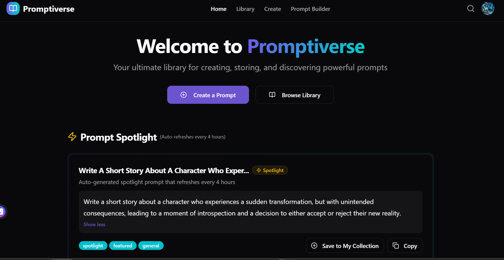
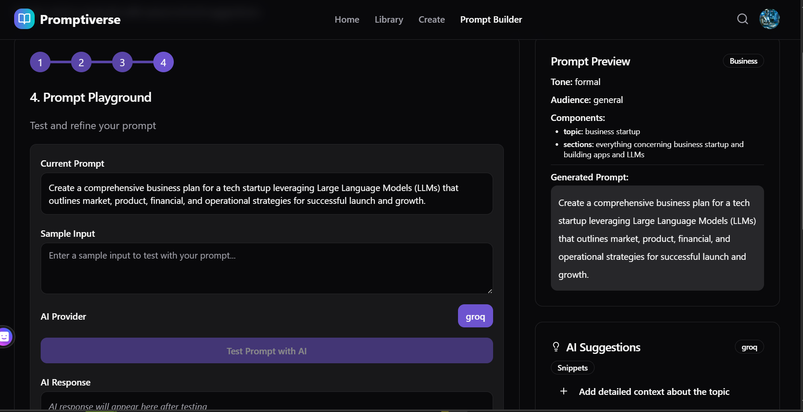
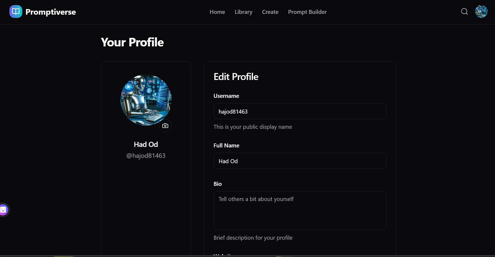
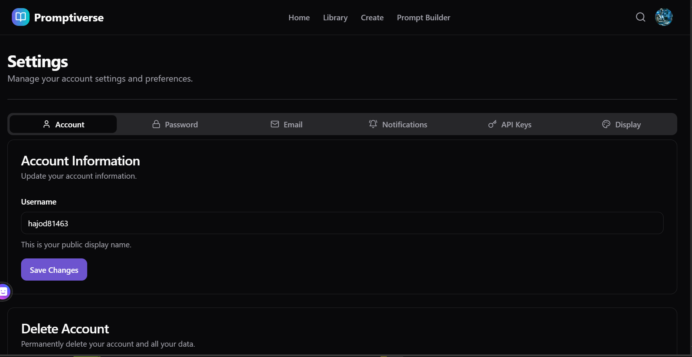

# Promptiverse - Technical Documentation

## Table of Contents

1. [Introduction](#introduction)
2. [Architecture Overview](#architecture-overview)
3. [Project Structure](#project-structure)
4. [Key Components](#key-components)
5. [Database Schema](#database-schema)
6. [API Integration](#api-integration)
7. [Authentication](#authentication)
8. [State Management](#state-management)
9. [Deployment](#deployment)
10. [Development Guidelines](#development-guidelines)
11. [Troubleshooting](#troubleshooting)

## Introduction

Promptiverse is a web application designed to help users create, manage, and share AI prompts. The application provides a guided interface for building effective prompts, a library for organizing personal prompts, and features for discovering prompts shared by others.



### Core Features

- **Prompt Builder**: Step-by-step interface for creating prompts with AI assistance
- **Prompt Library**: Personal collection of prompts with organization features
- **Spotlight Prompts**: Auto-generated featured prompts that refresh periodically
- **Multi-Provider AI Integration**: Support for OpenAI, Google Gemini, and Groq

## Architecture Overview

Promptiverse follows a modern React application architecture:

- **Frontend**: React with TypeScript, built using Vite
- **UI Components**: shadcn/ui components built on Radix UI primitives
- **Styling**: Tailwind CSS for utility-first styling
- **Routing**: React Router for client-side routing
- **State Management**: React Query for server state and React Context for UI state
- **Backend**: Supabase for authentication, database, and storage
- **AI Services**: Integration with multiple AI providers via their official SDKs

### Data Flow

1. User interactions trigger state changes in React components
2. Data fetching is handled by React Query hooks that communicate with Supabase
3. AI-related operations are processed through the AI service layer
4. Authentication state is managed through the AuthContext provider
5. Form state is managed using React Hook Form with Zod validation

## Project Structure

The project follows a feature-based organization with shared components and utilities:

```bash
promtiverse/
├── public/             # Static assets
├── src/                # Source code
│   ├── components/     # Reusable UI components
│   │   ├── ui/         # shadcn/ui components
│   │   └── ...         # Custom components
│   ├── contexts/       # React context providers
│   │   ├── AuthContext.tsx  # Authentication context
│   │   └── ...         # Other context providers
│   ├── hooks/          # Custom React hooks
│   │   ├── use-prompts.ts  # Hooks for prompt operations
│   │   ├── use-categories.ts  # Hooks for category operations
│   │   ├── use-api-keys.ts  # Hooks for API key management
│   │   ├── use-ai-services.ts  # Hooks for AI service operations
│   │   └── ...         # Other hooks
│   ├── integrations/   # External service integrations
│   │   └── supabase/   # Supabase client and types
│   ├── lib/            # Utility functions and types
│   │   ├── schemas/    # Zod validation schemas
│   │   ├── supabase.ts # Supabase types
│   │   └── utils/      # Helper utilities
│   ├── pages/          # Page components
│   │   ├── HomePage.tsx
│   │   ├── LibraryPage.tsx
│   │   ├── PromptBuilderPage.tsx
│   │   ├── SettingsPage.tsx
│   │   └── ...         # Other pages
│   ├── services/       # Service layer
│   │   ├── ai/         # AI service implementations
│   │   │   ├── openai.ts
│   │   │   ├── gemini.ts
│   │   │   ├── groq.ts
│   │   │   └── types.ts
│   │   ├── spotlight-prompt.ts  # Spotlight prompt service
│   │   └── ...         # Other services
│   ├── App.tsx         # Main application component
│   └── main.tsx        # Application entry point
├── supabase/           # Supabase configuration
│   └── migrations/     # Database migration scripts
└── ...                 # Configuration files
```

## Key Components

### Prompt Builder

The Prompt Builder is a multi-step form that guides users through creating effective prompts:



1. **PromptBuilderPage.tsx**: Main container component that manages the overall state
2. **PromptBuilderStepper.tsx**: Manages the step navigation and form state
3. **PromptBuilderPreview.tsx**: Displays a live preview of the generated prompt
4. **PromptBuilderSuggestions.tsx**: Shows AI-generated suggestions at each step

The builder uses a step-by-step approach:
1. Select a category
2. Choose a tone
3. Define the target audience
4. Add specific components

At each step, AI-powered suggestions are provided to help users make effective choices.

### Prompt Library

The Prompt Library allows users to manage their collection of prompts:


1. **LibraryPage.tsx**: Main container component for the library
2. **PromptGrid.tsx** and **PromptList.tsx**: Display prompts in different views
3. **PromptCard.tsx**: Individual prompt display component
4. **PromptFilters.tsx**: Filtering and search functionality

The library supports:
- Grid and list views
- Filtering by category and tags
- Searching by text
- Favoriting prompts
- Editing and deleting prompts

### AI Service Integration

The application integrates with multiple AI providers through a unified interface:

1. **services/ai/types.ts**: Defines the common interface for all AI services
2. **services/ai/openai.ts**: OpenAI implementation
3. **services/ai/gemini.ts**: Google Gemini implementation
4. **services/ai/groq.ts**: Groq implementation
5. **hooks/use-ai-services.ts**: Hook for accessing AI services

The AI service layer provides:
- Provider-agnostic API for generating prompts and suggestions
- Automatic fallback between providers based on available API keys
- Optimized prompting techniques for each provider

## Database Schema

The application uses Supabase as its backend with the following main tables:

### Users

The `users` table is managed by Supabase Auth and extended with:



```sql
CREATE TABLE user_profiles (
  id UUID REFERENCES auth.users(id) PRIMARY KEY,
  username TEXT UNIQUE,
  display_name TEXT,
  avatar_url TEXT,
  created_at TIMESTAMP WITH TIME ZONE DEFAULT NOW(),
  updated_at TIMESTAMP WITH TIME ZONE DEFAULT NOW()
);
```

### Prompts

The `prompts` table stores all user-created and system-generated prompts:

```sql
CREATE TABLE prompts (
  id UUID PRIMARY KEY DEFAULT uuid_generate_v4(),
  user_id UUID REFERENCES auth.users(id),
  title TEXT NOT NULL,
  text TEXT NOT NULL,
  category TEXT NOT NULL,
  description TEXT,
  tags TEXT[] DEFAULT '{}',
  is_public BOOLEAN DEFAULT FALSE,
  created_at TIMESTAMP WITH TIME ZONE DEFAULT NOW(),
  updated_at TIMESTAMP WITH TIME ZONE DEFAULT NOW()
);
```

### Categories

The `categories` table stores available prompt categories:

```sql
CREATE TABLE categories (
  id UUID PRIMARY KEY DEFAULT uuid_generate_v4(),
  name TEXT UNIQUE NOT NULL,
  description TEXT,
  created_at TIMESTAMP WITH TIME ZONE DEFAULT NOW(),
  updated_at TIMESTAMP WITH TIME ZONE DEFAULT NOW()
);
```

### Favorites

The `favorites` table tracks which prompts users have favorited:

```sql
CREATE TABLE favorites (
  id UUID PRIMARY KEY DEFAULT uuid_generate_v4(),
  user_id UUID REFERENCES auth.users(id) NOT NULL,
  prompt_id UUID REFERENCES prompts(id) NOT NULL,
  created_at TIMESTAMP WITH TIME ZONE DEFAULT NOW(),
  UNIQUE(user_id, prompt_id)
);
```

### API Keys

The `api_keys` table securely stores user API keys for different providers:



```sql
CREATE TABLE api_keys (
  id UUID PRIMARY KEY DEFAULT uuid_generate_v4(),
  user_id UUID REFERENCES auth.users(id) NOT NULL,
  provider TEXT NOT NULL,
  api_key TEXT NOT NULL,
  created_at TIMESTAMP WITH TIME ZONE DEFAULT NOW(),
  updated_at TIMESTAMP WITH TIME ZONE DEFAULT NOW(),
  UNIQUE(user_id, provider)
);
```

## API Integration

### AI Provider Integration

The application integrates with multiple AI providers:

#### OpenAI

```typescript
import OpenAI from 'openai';

const openai = new OpenAI({
  apiKey: process.env.OPENAI_API_KEY,
});

const response = await openai.chat.completions.create({
  model: "gpt-3.5-turbo",
  messages: [
    { role: "system", content: "You are a helpful assistant." },
    { role: "user", content: "Generate a prompt for creative writing." }
  ],
});
```

#### Google Gemini

```typescript
import { GoogleGenerativeAI } from '@google/generative-ai';

const genAI = new GoogleGenerativeAI(process.env.GEMINI_API_KEY);
const model = genAI.getGenerativeModel({ model: "gemini-pro" });

const result = await model.generateContent({
  contents: [{ role: "user", parts: [{ text: "Generate a prompt for creative writing." }] }],
});
```

#### Groq

```typescript
import Groq from 'groq-sdk';

const groq = new Groq({
  apiKey: process.env.GROQ_API_KEY,
});

const response = await groq.chat.completions.create({
  model: "llama2-70b-4096",
  messages: [
    { role: "system", content: "You are a helpful assistant." },
    { role: "user", content: "Generate a prompt for creative writing." }
  ],
});
```

### Supabase Integration

The application uses Supabase for data storage and authentication:

```typescript
import { createClient } from '@supabase/supabase-js';

const supabaseUrl = import.meta.env.VITE_SUPABASE_URL;
const supabaseAnonKey = import.meta.env.VITE_SUPABASE_ANON_KEY;

export const supabase = createClient(supabaseUrl, supabaseAnonKey);
```

## Authentication

Authentication is handled by Supabase Auth with a custom AuthContext provider:

```typescript
// src/contexts/AuthContext.tsx
import { createContext, useContext, useEffect, useState } from 'react';
import { supabase } from '@/integrations/supabase/client';
import { User } from '@supabase/supabase-js';

interface AuthContextType {
  isAuthenticated: boolean;
  user: User | null;
  loading: boolean;
  signIn: (email: string, password: string) => Promise<void>;
  signUp: (email: string, password: string) => Promise<void>;
  signOut: () => Promise<void>;
}

const AuthContext = createContext<AuthContextType | undefined>(undefined);

export const AuthProvider = ({ children }) => {
  const [user, setUser] = useState<User | null>(null);
  const [loading, setLoading] = useState(true);

  useEffect(() => {
    // Check for active session
    const checkSession = async () => {
      const { data } = await supabase.auth.getSession();
      setUser(data.session?.user ?? null);
      setLoading(false);
    };

    checkSession();

    // Listen for auth changes
    const { data: { subscription } } = supabase.auth.onAuthStateChange(
      (_event, session) => {
        setUser(session?.user ?? null);
        setLoading(false);
      }
    );

    return () => {
      subscription.unsubscribe();
    };
  }, []);

  // Auth methods
  const signIn = async (email: string, password: string) => {
    await supabase.auth.signInWithPassword({ email, password });
  };

  const signUp = async (email: string, password: string) => {
    await supabase.auth.signUp({ email, password });
  };

  const signOut = async () => {
    await supabase.auth.signOut();
  };

  return (
    <AuthContext.Provider
      value={{
        isAuthenticated: !!user,
        user,
        loading,
        signIn,
        signUp,
        signOut,
      }}
    >
      {children}
    </AuthContext.Provider>
  );
};

export const useAuth = () => {
  const context = useContext(AuthContext);
  if (context === undefined) {
    throw new Error('useAuth must be used within an AuthProvider');
  }
  return context;
};
```

## State Management

### Server State

Server state is managed using TanStack Query (React Query):

```typescript
// src/hooks/use-prompts.ts
import { useQuery, useMutation, useQueryClient } from '@tanstack/react-query';
import { supabase } from '@/integrations/supabase/client';
import { Prompt } from '@/lib/supabase';

export function usePrompts() {
  const queryClient = useQueryClient();

  const getPrompts = async (): Promise<Prompt[]> => {
    const { data, error } = await supabase
      .from('prompts')
      .select('*')
      .order('created_at', { ascending: false });

    if (error) throw error;
    return data;
  };

  const createPrompt = async (prompt: Omit<Prompt, 'id' | 'created_at' | 'user_id' | 'updated_at'>): Promise<Prompt> => {
    const { data, error } = await supabase
      .from('prompts')
      .insert(prompt)
      .select()
      .single();

    if (error) throw error;
    return data;
  };

  const updatePrompt = async (prompt: Partial<Prompt> & { id: string }): Promise<Prompt> => {
    const { data, error } = await supabase
      .from('prompts')
      .update(prompt)
      .eq('id', prompt.id)
      .select()
      .single();

    if (error) throw error;
    return data;
  };

  const deletePrompt = async (id: string): Promise<void> => {
    const { error } = await supabase
      .from('prompts')
      .delete()
      .eq('id', id);

    if (error) throw error;
  };

  const promptsQuery = useQuery({
    queryKey: ['prompts'],
    queryFn: getPrompts,
  });

  const createPromptMutation = useMutation({
    mutationFn: createPrompt,
    onSuccess: () => {
      queryClient.invalidateQueries({ queryKey: ['prompts'] });
    },
  });

  const updatePromptMutation = useMutation({
    mutationFn: updatePrompt,
    onSuccess: () => {
      queryClient.invalidateQueries({ queryKey: ['prompts'] });
    },
  });

  const deletePromptMutation = useMutation({
    mutationFn: deletePrompt,
    onSuccess: () => {
      queryClient.invalidateQueries({ queryKey: ['prompts'] });
    },
  });

  return {
    prompts: promptsQuery.data ?? [],
    isLoading: promptsQuery.isLoading,
    error: promptsQuery.error,
    createPrompt: createPromptMutation.mutate,
    updatePrompt: updatePromptMutation.mutate,
    deletePrompt: deletePromptMutation.mutate,
  };
}
```

### Form State

Form state is managed using React Hook Form with Zod validation:


```typescript
// src/components/PromptForm.tsx
import { useForm } from 'react-hook-form';
import { zodResolver } from '@hookform/resolvers/zod';
import { z } from 'zod';

const formSchema = z.object({
  title: z.string().min(3).max(100),
  text: z.string().min(10),
  category: z.string().min(1),
  description: z.string().optional(),
  is_public: z.boolean().default(false),
  tags: z.array(z.string()).optional(),
});

type FormValues = z.infer<typeof formSchema>;

export default function PromptForm() {
  const form = useForm<FormValues>({
    resolver: zodResolver(formSchema),
    defaultValues: {
      title: '',
      text: '',
      category: '',
      description: '',
      is_public: false,
      tags: [],
    },
  });

  const onSubmit = (values: FormValues) => {
    console.log(values);
  };

  return (
    <form onSubmit={form.handleSubmit(onSubmit)}>
      {/* Form fields */}
    </form>
  );
}
```

## Deployment

### Prerequisites

- Node.js (v18 or later)
- npm, yarn, or bun
- Supabase account
- API keys for desired AI providers (OpenAI, Google Gemini, Groq)

### Environment Variables

Create a `.env` file with the following variables:

```env
VITE_SUPABASE_URL=your_supabase_project_url
VITE_SUPABASE_ANON_KEY=your_supabase_anon_key
```

### Build Process

```bash
# Install dependencies
npm install

# Build for production
npm run build

# Preview the production build
npm run preview
```

### Deployment Options

1. **Static Hosting**: Deploy the built files to any static hosting service (Netlify, Vercel, GitHub Pages)
2. **Docker**: Use the provided Dockerfile to containerize the application
3. **Self-hosted**: Deploy to your own server using Nginx or Apache

## Development Guidelines

### Code Style

- Use TypeScript for type safety
- Follow ESLint rules for code quality
- Use Prettier for code formatting
- Use named exports for better tree-shaking

### Component Structure

- Use functional components with hooks
- Keep components focused on a single responsibility
- Extract reusable logic into custom hooks
- Use composition over inheritance

### State Management

- Use React Query for server state
- Use React Context for global UI state
- Use local state for component-specific state
- Use URL state for shareable state

### Testing

- Write unit tests for utility functions
- Write component tests for UI components
- Write integration tests for key user flows
- Use mock service workers for API testing

## Troubleshooting

### Common Issues

#### Authentication Issues

- Check that Supabase URL and anon key are correct
- Verify that email confirmation is properly set up in Supabase
- Check for CORS issues if deploying to a different domain

#### API Integration Issues

- Verify that API keys are correctly stored and retrieved
- Check rate limits on the AI provider services
- Ensure proper error handling for API failures

#### Performance Issues

- Use React Query's caching capabilities
- Implement pagination for large data sets
- Use code splitting for large components
- Optimize images and assets

### Debugging

- Use React DevTools for component debugging
- Use Network tab in browser DevTools for API issues
- Check Supabase logs for backend errors
- Use console.log strategically (remove before production)

---

This documentation is a living document and will be updated as the project evolves.
